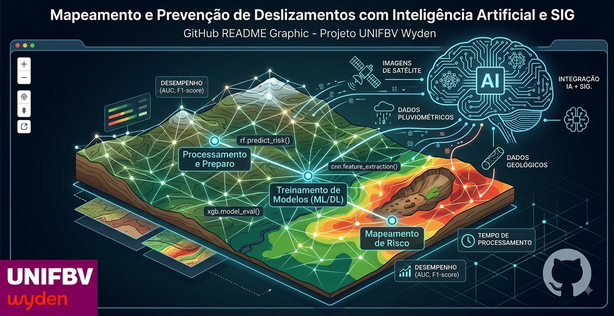

  

  <h1>
    PIBIC - Mapeamento de Encostas com IA e SIG
    
  </h1>

Repositório desenvolvido para o projeto de Iniciação Científica (PIBIC) sobre **Mapeamento de Encostas com Inteligência Artificial e SIG**, vinculado à [UniFBV](https://www.wyden.com.br/unidades/unifbv/).

##  Análise de Risco Geológico em Pernambuco
**Equipe do Projeto:**
* **Pesquisador:** Leonardo H. S. Correia
* **Orientadora:** Dra. Betânia Queiroz
* **Coordenador do curso:** Adriano Pereira
* **Data:** JUN/2026

---

##  O Problema
* Eventos extremos estão cada vez mais frequentes e intensos devido às mudanças climáticas.
* O estado de Pernambuco possui elevada suscetibilidade a deslizamentos, principalmente na Região Metropolitana do Recife (RMR).
* As fortes chuvas de maio de 2022 provocaram mais de 130 mortes e deixaram milhares de desabrigados, inundando 17% da área urbanizada do Recife.
* O mapeamento atual depende de análises manuais, que são lentas e sujeitas a erros.
* Os métodos tradicionais não conseguem acompanhar a dinâmica urbana e climática atual.

##  A Solução e Objetivo
A solução proposta pela pesquisa é a **integração de Inteligência Artificial (IA) e Sistemas de Informação Geográfica (SIG)** para automatizar o mapeamento de áreas suscetíveis a deslizamentos.

O **objetivo** é identificar o modelo mais adequado para o mapeamento eficiente e automatizado em Pernambuco, realizando uma comparação rigorosa entre diferentes arquiteturas de Machine Learning e Deep Learning.

---

##  Modelos Avaliados
O projeto compara as seguintes tecnologias:
* **Machine Learning:** Random Forest (RF), Support Vector Machine (SVM) e XGBoost.
* **Deep Learning:** Redes Neurais Convolucionais (CNN), U-Net, Transfer Learning e LSTM.

**Critérios de Comparação:**
* **Desempenho:** Acurácia, F1-score, AUC, IoU e Índice Kappa.
* **Necessidade de Dados:** A quantidade mínima de dados necessária para um treinamento efetivo.
* **Tempo:** Tempo gasto no treinamento e no processamento para a geração dos mapas.
* **Aplicabilidade:** Facilidade de uso, potencial de integração com o SIG e viabilidade de aplicação em cenários reais.

---

##  Ecossistema e Ferramentas
* **Ecossistema SIG:** Processamento espacial avançado para análise de estabilidade construído sobre o ArcGIS e o QGIS (versão 3.40.12, manipulando algoritmos e arquivos KMZ/GPKG do projeto).
* **Cloud Computing:** Uso do Google Earth Engine para processamento de Big Data em escala regional.
* **Modelagem em Python:** Utilização das bibliotecas Scikit-learn, TensorFlow e OpenCV para treinamento supervisionad.
* **Validação Rigorosa:** Auditoria de acurácia utilizando Matrizes de Confusão, Curva ROC e Índice Kappa.

**Fontes de Dados:**
* **Dados Topográficos e Climáticos:** APAC, CEMADEN e Topodata para análise de declividade, níveis de chuva e curvatura.
* **Sensoriamento Remoto:** Imagens de satélites Sentinel-1 (SAR) e Sentinel-2, combinadas com dados LiDAR e ortoimagens de alta resolução.

---

## ⚠ Metodologia (Percurso)

O fluxo analítico do projeto está estruturado em 7 etapas principais:
1. **Revisão Sistemática:** Levantamento de artigos e estudos científicos focados em IA, SIG e mapeamento de riscos de deslizamentos.
2. **Levantamento de Dados:** Coleta de imagens de satélite, modelos topográficos, dados geológicos, dados pluviométricos e inventário de deslizamentos ocorridos.
3. **Pré-Processamento:** Realização de correções radiométricas, recorte da área de estudo, normalização, geração de variáveis preditoras (declividade, curvatura, etc.) e preparo das amostras.
4. **Construção dos Modelos:** Definição arquitetural e implementação dos modelos de Machine Learning (RF, SVM, XGBoost) e Deep Learning (CNN, U-Net, etc.).
5. **Treinamento:** Divisão do dataset (treino, validação e teste) seguida do treinamento dos modelos com ajuste de hiperparâmetros.
6. **Avaliação:** Avaliação do desempenho de cada modelo através de métricas (AUC, F1-score, IoU, Kappa) e análise comparativa.
7. **Mapas de Risco:** Geração final dos mapas de suscetibilidade e risco de deslizamentos em ambiente SIG para apoio e tomada de decisão.

---

##  Trabalhos Futuros
A pesquisa abre caminhos para as seguintes expansões:
* **Dados Climáticos e Monitoramento em Tempo Real:** Integrar variáveis de umidade do solo e previsões meteorológicas dinâmicas para a criação de alertas operacionais.
* **Expansão Geográfica e Resiliência Regional:** Replicar a metodologia em outros municípios pernambucanos, adaptando os modelos às realidades geomorfológicas locais.
* **Avanços em Deep Learning:** Avaliar com maior profundidade o uso de Visão Computacional Avançada (CNNs) e Transfer Learning aplicados a imagens de satélite de altíssima resolução.
* **Impacto Social e Políticas Públicas:** Garantir a aplicabilidade direta dos modelos gerados na gestão pública, visando promover justiça social e ações proativas de prevenção.

---
## Ecosystem & Apps
  🌐 SentinelaGlobal Web App: Versão interativa online do sistema de mapeamento e prevenção de desastres. Clique aki --> [App](https://sentinelaglobal.freebuff.app/)

##  Referências Principais
* **Liu (2023):** Integração de Machine Learning com SIG para mapeamento de suscetibilidade a deslizamentos induzidos por chuva.
* **Ghorbanzadeh (2022):** Utilização de modelos de Deep Learning (CNN) e a base Landslide4Sense para detecção automática de cicatrizes de deslizamentos.
* **Francini (2022):** Aplicação da rede U-Net com imagens aéreas e dados SIG para identificar áreas edificadas em zonas de alto risco.
* **He (2024):** Revisão sistemática e abrangente sobre aplicações de IA nos eixos de detecção, mapeamento de suscetibilidade e previsão de deslocamentos.
* **Coutinho (2025):** Panorama detalhado da geotecnia e dos movimentos gravitacionais de massa no Brasil, abordando causas, consequências e soluções.
* **Marengo (2023):** Análise aprofundada do evento extremo de chuvas de maio de 2022 no Recife, cobrindo inundações e deslizamentos fatais.
* **Nocentini (2024):** Avaliação espaço-temporal de probabilidade de deslizamentos em escala regional através de machine learning.
* **USGS / Highland & Bobrowsky (2008):** Manual de deslizamentos - guia fundamental para a compreensão damecânica dos deslizamentos

## Licença

Projeto acadêmico – PIBIC. Uso restrito a pesquisa.
